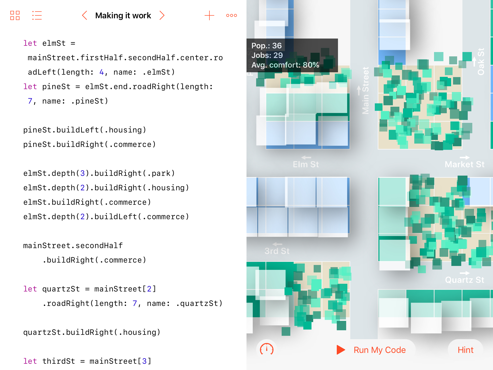

# Paperville

  

My WWDC 2018 playground. **ACCEPTED**.

**Paperville** provides a toolset to create a city model using Swift code only. You can build roads, houses, commercial areas, factories and parks with intuitive and powerful syntax. Your code on the left acts as a blueprint, and on the right you can see the interactive city.

## Download and install

**Paperville** is an Swift PlaygroundBook for iPad. Download the latest version from the [Releases](https://github.com/dreymonde/Paperville/releases) tab.